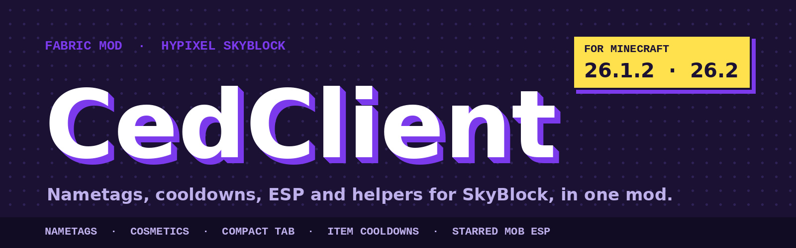

<div align="center">



<br>

[](https://github.com/CedNath/CedClient/releases/latest)
[](https://github.com/CedNath/CedClient/releases)


**[Website](https://cedclient.kasajonny420-dab.workers.dev/)** &nbsp;·&nbsp;
**[Features](https://cedclient.kasajonny420-dab.workers.dev/features)** &nbsp;·&nbsp;
**[Releases](https://github.com/CedNath/CedClient/releases)** &nbsp;·&nbsp;
**[Report a bug](https://github.com/CedNath/CedClient/issues/new/choose)**

</div>

---

CedClient is a client-side Fabric mod for **Hypixel SkyBlock**. It adds custom nametags and cosmetics, a compact tab list and scoreboard, item cooldown timers, dungeon highlights and a set of quality-of-life features. Everything is optional: each feature can be switched on or off in the in-game menu.

> [!NOTE]
> CedClient is an independent project. It is not affiliated with or endorsed by Mojang, Microsoft or Hypixel.

## Contents

- [Versions](#versions)
- [Installation](#installation)
- [Features](#features)
- [Getting started](#getting-started)
- [Nametag formatting](#nametag-formatting)
- [Cosmetics](#cosmetics)
- [Privacy](#privacy)
- [Building from source](#building-from-source)
- [Project layout](#project-layout)
- [Credits](#credits)
- [License](#license)

## Versions

CedClient comes in two flavours, and each Minecraft version has its own branch and release files.

| Version | Minecraft | What it is |
| --- | --- | --- |
| **Full** | 26.1.2 | Everything below, including the helpers and ESP features. Default branch. |
| **Legit** | 26.1.2 | The same mod without automation and ESP features, for servers with strict rules. |
| **Full** | 26.2 | A port of the full version to Minecraft 26.2. |

Always check the rules of the server you play on before using any client mod. You use the helpers at your own risk.

## Installation

1. Install [Fabric Loader](https://fabricmc.net/use/installer/) for your Minecraft version.
2. Download these mods into your `mods` folder:
   - [Fabric API](https://modrinth.com/mod/fabric-api)
   - [Fabric Language Kotlin](https://modrinth.com/mod/fabric-language-kotlin)
3. Download the CedClient file that matches your Minecraft version (and Full or Legit) from the [latest release](https://github.com/CedNath/CedClient/releases/latest) and put it in the same `mods` folder.
4. Start the game and press **P** to open the CedClient menu.

## Features

A short overview. The full list with descriptions is on the [features page](https://cedclient.kasajonny420-dab.workers.dev/features).

| Area | What you get |
| --- | --- |
| **Nametags & cosmetics** | Custom Nametag with colours, hex and gradients, synced cosmetics for other CedClient players, Player Scale |
| **Interface** | Compact Tab, Compact Scoreboard, Item Cooldowns, Daily Tasks, Chat Channel HUD, Time HUD, Inventory Buttons |
| **Highlights & vision** | Starred Mob ESP, Entity ESP, Block ESP, Floor Drops, Fullbright, Freecam, Zoom |
| **Helpers** | Fishing Helper, Lasso Helper, Pangolin Catcher, Coralot Helper, Tiny Dancer Helper |
| **Quality of life** | Chat Filter, Warp Shortcuts, Screenshot Tweaks, Auto Sprint, Hide Recipe Book |
| **Work in progress** | Loot Tracker, Profile Viewer |

The **Legit** version leaves out the helpers and the ESP and highlight features.

## Getting started

| Key | Action |
| --- | --- |
| `P` | Open the CedClient menu |
| `B` | Toggle Freecam |
| `C` (hold) | Zoom, scroll to zoom further |

Keys can be changed in Minecraft's controls menu.

| Command | What it does |
| --- | --- |
| `/cedclient` or `/cc` | Open the menu |
| `/cedclient hud` | Edit the HUD layout |
| `/cedclient nametag <text>` | Set your custom nametag (empty clears it) |
| `/cedclient daily` | Show the dailies you still have to do |
| `/cedclient warp list` | List your warp shortcuts (`add`, `remove`, `enable`, `disable`) |
| `/cedclient esp ...` | Choose which mobs Entity ESP shows or hides |
| `/cedclient pv` | Profile Viewer (work in progress) |
| `/cedloot` | Loot summary (work in progress) |

## Nametag formatting

Your custom nametag and synced cosmetics support:

| Syntax | Result |
| --- | --- |
| `&a`, `&l`, `&o`, `&n`, `&m`, `&k`, `&r` | Classic colour and style codes |
| `&#RRGGBB` | Any hex colour |
| `<gradient:#RRGGBB:#RRGGBB>text</gradient>` | Colour gradient |
| `<rainbow>text</rainbow>` | Animated rainbow |

Example: `&l<gradient:#7c3aed:#ffe14d>CedNath</gradient>`

## Cosmetics

Other CedClient players can be given a custom nametag and model size. You see them on everyone running the mod, and the **Cosmetics** module switches the whole thing on or off.

The list is downloaded from the [CedClient website](https://cedclient.kasajonny420-dab.workers.dev/) and refreshed every few minutes while the game runs. If the website is unreachable, CedClient falls back to a list stored in a public GitHub repository, and keeps the last list it received so cosmetics still work offline. Sizes only change how a model is drawn. They never change hitboxes or reach.

## Privacy

Once per launch CedClient sends your **Minecraft username, UUID, CedClient version and Minecraft version** to the developer's website, so the developer can see how many people use the mod. It never sends your session token, chat, inventory, the server you are on or any other game data.

To turn it off, set this in `config/cedclient-usage.properties` (the file is created on first launch):

```properties
shareUsage=false
```

The mod also downloads the public cosmetics list described above. That request contains no information about you.

## Building from source

You need the JDK that your Minecraft version requires (see `build.gradle.kts`).

```bash
git clone https://github.com/CedNath/CedClient.git
cd CedClient
git checkout 26.1.2        # or 26.2, or the Legit branch
./gradlew build
```

The finished jar is in `build/libs/`. On Windows use `gradlew.bat build`.

## Project layout

```
src/main
├─ kotlin/ced/cedclient
│  ├─ features/     modules (render, funqol, misc, loot) and their settings
│  ├─ state/        always-on state: island, dungeon, party, cosmetics sync
│  ├─ render/       custom rendering code
│  ├─ ui/           ClickGUI and inventory buttons
│  ├─ commands/     /cedclient and friends
│  ├─ config/       saving and loading module settings
│  └─ utils/        small helpers, including the usage ping
├─ java/ced/cedclient/mixin/   Mixins into Minecraft
└─ resources/                  mod metadata, fonts, language files
```

## Credits

- Architecture and several feature ideas are inspired by [SkyHanni](https://github.com/hannibal002/SkyHanni). No code is copied from it.
- Built on [Fabric](https://fabricmc.net/), [Fabric API](https://github.com/FabricMC/fabric) and [Fabric Language Kotlin](https://github.com/FabricMC/fabric-language-kotlin).

## License

See [LICENSE.txt](LICENSE.txt).

## Feedback

Found a bug or have an idea? [Open an issue](https://github.com/CedNath/CedClient/issues/new/choose). Please include your CedClient version, Minecraft version and the game log if the game crashed.
